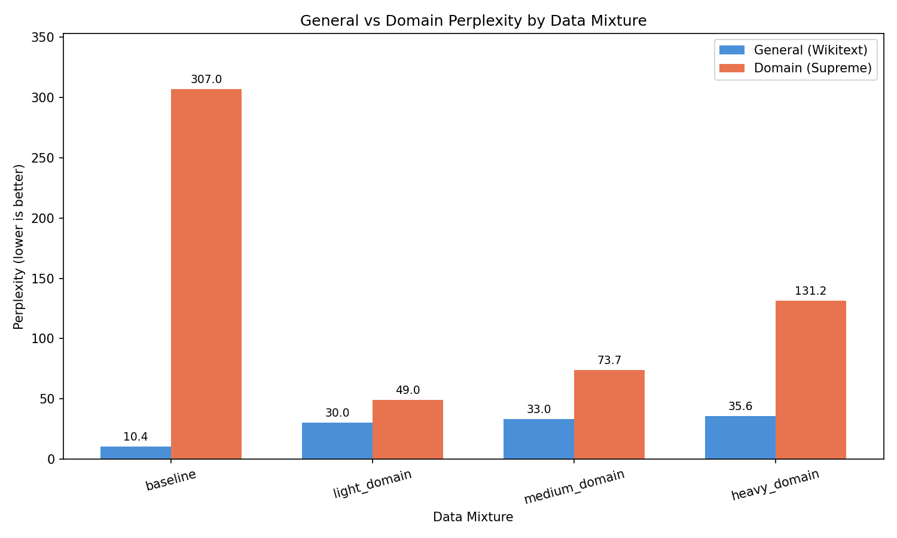

# Domain Pre-training Study

Training a small transformer from scratch to measure how domain-specific data affects model quality. The domain is fashion/streetwear, using data from a Supreme community platform I've been running for 5+ years.

## The Question

When you're building a pre-training corpus, how much domain-specific text should you mix in? Too little and the model doesn't learn the domain. Too much and it starts losing general language ability. I wanted to actually measure where the trade-off lands.

## How It Works

I train the same 124M parameter transformer four times with different data mixtures:

| Run | General | Domain | Notes |
|-----|---------|--------|-------|
| baseline | 100% | 0% | Control, no domain data |
| light_domain | 95% | 5% | Small domain signal |
| medium_domain | 90% | 10% | Supreme data oversampled 3x |
| heavy_domain | 80% | 20% | Supreme data oversampled 6x |

Everything else stays identical: architecture, hyperparameters, tokenizer, number of training steps. The only variable is the data mix.

## Model

Decoder-only transformer written from scratch in PyTorch:

- 12 layers, 768 hidden dim, 12 attention heads (~110M params with weight tying)
- RMSNorm (pre-norm), RoPE positional embeddings, GeLU activations
- 1024 token context, 32K vocab BPE tokenizer trained on the combined corpus

## Data

**Domain sources (~10M tokens):**
- Supreme product database: 10K+ items with descriptions, prices, colorways
- 184 news articles about drops and collaborations
- 368 weekly droplists with sellout times across EU/US/JPN
- Fashion product datasets from HuggingFace
- Wikipedia articles on streetwear, fashion brands, Supreme

**General source (~80M tokens):**
- FineWeb-Edu sample (filtered Common Crawl)

Supreme data is serialized as natural text for pre-training, not JSON:

```
Supreme Spring/Summer 2026, Week 8 Drop, April 16, 2026

Cross Varsity Jacket (Jackets)
Wool blend with cowhide leather sleeves, fill and quilted satin lining.
Colorways: Dark Green, Black. Price: $498 USD / 528 EUR / 448 GBP.
Sold out in EU in 19 seconds (Black XXL fastest).
```

## Results

| Mixture | General PPL | Domain PPL | Domain Gain |
|---------|------------|------------|-------------|
| baseline (100% general) | **10.44** | 307.04 | - |
| light_domain (95/5) | 30.02 | **48.95** | 84.1% |
| medium_domain (90/10) | 33.00 | 73.73 | 76.0% |
| heavy_domain (80/20) | 35.57 | 131.21 | 57.3% |

Lower perplexity = better. Trained for 30K optimizer steps per run on an H100 SXM.

The light_domain mix (just 5% domain data) produced the best domain perplexity by far. Adding more domain data through oversampling actually hurt: the model memorized the repeated Supreme text instead of generalizing from it. This lines up with what you'd expect from the oversampling literature. Repeating a small corpus 3x or 6x inflates the training signal for those exact documents without teaching the model anything new about the domain.

General perplexity takes a hit as soon as you introduce any domain data (10.44 to 30.02), but after that initial drop it doesn't degrade much further (30 to 33 to 35). The model trades some general capability for domain knowledge, and the trade-off is front-loaded.

If I were running this again, I'd try augmenting the domain data with paraphrases or synthetic variations rather than raw oversampling. That would give the model more diverse domain signal without the memorization risk.



## Evaluation

Metrics per run:
- General perplexity on held-out general text (does domain data hurt general quality?)
- Domain perplexity on held-out Supreme text (does domain data help?)

## Setup

### Prerequisites
- Python 3.11+
- PyTorch 2.x
- GPU with 24+ GiB VRAM for training (A10 or better)

### Installation
```bash
git clone https://github.com/nicktcode/domain-pretrain-study
cd domain-pretrain-study
pip install -r requirements.txt
```

### Preparing data
```bash
# Export Supreme data (requires database access)
python -m data.export_supreme --output-dir data/processed

# Fetch public datasets
python -m data.fetch_hf_datasets --output data/processed/hf_fashion.txt
python -m data.fetch_wikipedia --output data/processed/wikipedia_fashion.txt
python -m data.fetch_fineweb --output data/processed/fineweb_edu.txt

# Build corpus and mixtures
python -m data.build_corpus --input-dir data/processed --output-dir data/corpus
python -m data.build_mixtures --corpus-dir data/corpus --output-dir data/mixtures
```

### Training the tokenizer
```bash
python -m tokenizer.train_tokenizer --corpus-dir data/corpus --output tokenizer/tokenizer.json
```

### Running experiments
```bash
# Single run
python -m train.run_experiment --mixture baseline

# All 4 runs
python -m train.run_all
```

### Evaluation
```bash
python -m eval.run_eval --checkpoint-dir checkpoints
python -m analysis.compare_runs --results eval/results.json
```

## Project Structure

```
config/             model, training, and data mixture configs
data/               export, fetch, and corpus building scripts
tokenizer/          BPE tokenizer training
model/              transformer implementation (config, RoPE, attention, FFN)
train/              dataset, scheduler, trainer, experiment runner
eval/               perplexity computation and evaluation runner
analysis/           result comparison and visualization
tests/              unit tests for model, data pipeline, and training
```

## Design Decisions

**Custom model, not HuggingFace.** I wrote the transformer from scratch (~300 lines) to understand every component. Uses modern choices (RMSNorm, RoPE) instead of vanilla GPT-2.

**Config-driven experiments.** Architecture, training, and data mixtures are all in YAML files. Changing a run means editing one config value, not touching code.

**Natural text serialization.** Supreme data is converted to readable text rather than JSON or structured formats. The model should learn domain language through natural text, not parsing syntax.

**Oversampling for balance.** With only ~10M tokens of domain text vs ~80M general, I repeat domain data to hit target ratios. This follows the approach discussed in the Llama 2 paper but risks memorization, which I track by monitoring domain perplexity.

## Limitations

- 124M params and ~100M tokens is tiny. Results won't necessarily generalize to larger scales.
- The tokenizer is shared across all runs, so even the baseline benefits from fashion vocabulary.
- Single seed per run. Ideally I'd run 3x with different seeds and report variance.
- Oversampling domain data risks memorization rather than genuine learning.

## License

MIT
